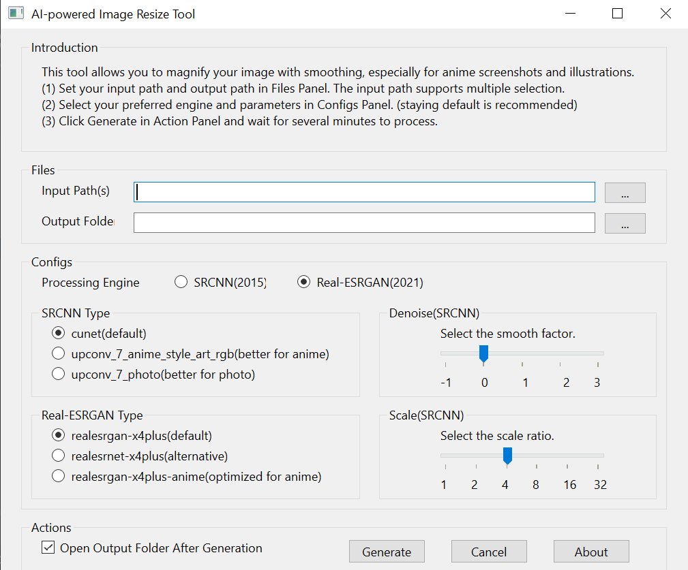

# resize
This tool allows you to magnify your image with smoothing, especially for anime screenshots and illustrations.
## Requirements

* Operating System: Windows X64
* Graphics Card: Vulkan Support

## Manual



(1) Set your input path and output path in Files Panel. The input path supports multiple selection.

(2) Select your preferred engine and parameters in Configs Panel. Staying default is recommended. Only SRCNN supports selection of magnification and denoising strength.

(3) Click Generate in Action Panel and wait for several minutes to process. 

## Develop

1. Clone the repository

2. Download waifu2x and real-esrgan package

    download version 20210521
    https://github.com/nihui/waifu2x-ncnn-vulkan/releases
    unzip to folder waifu2x

    download version v0.2.3.0
    https://github.com/xinntao/Real-ESRGAN/releases
    unzip to folder realesrgan

3. Prepare python environment
```
pip install PySide6
```

## Build

1. Prepare python environment
```
pip install PyInstaller
```

2. Build package
```
pyinstaller --onefile --windowed --icon=logo.ico main.py  --add-data "realesrgan;realesrgan" --add-data "waifu2x;waifu2x" 
```
